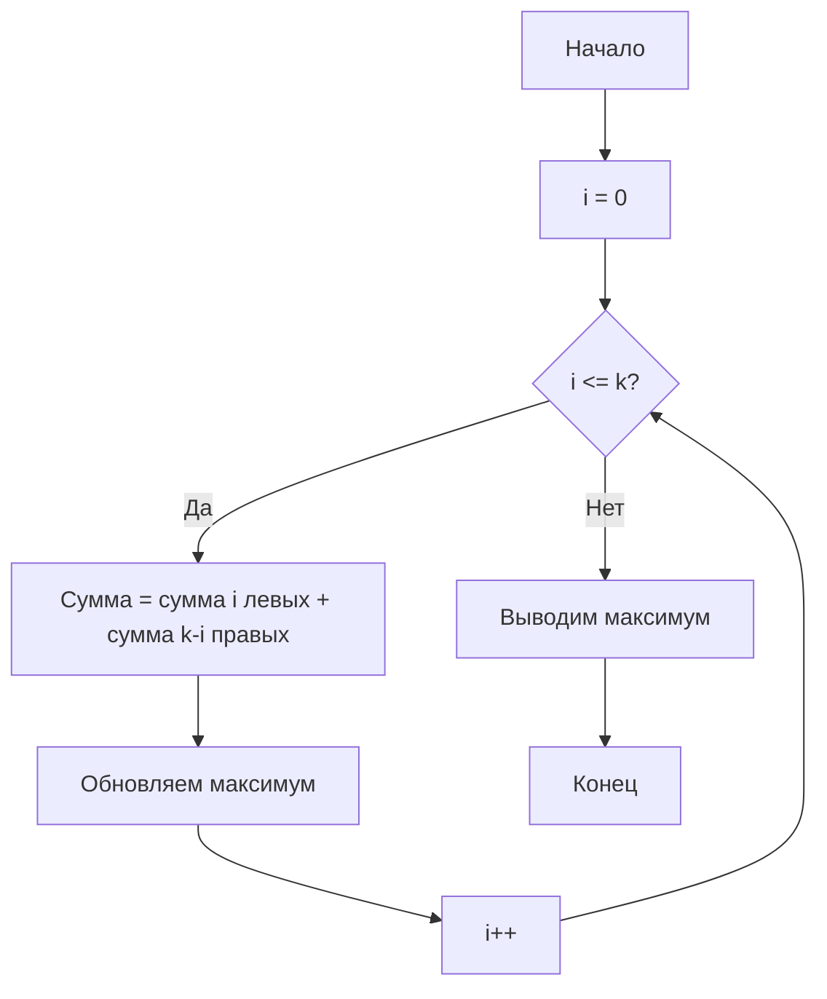
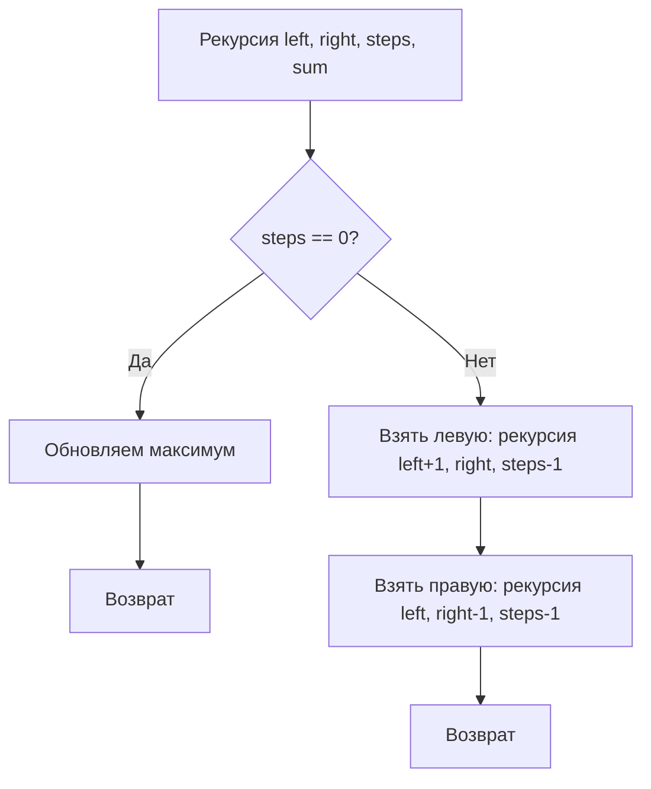

# 🎯 РАЗБОР ЗАДАЧИ: МАКСИМАЛЬНАЯ СУММА ПРИ ВЫБОРЕ K КАРТОЧЕК С КОНЦОВ

## 📖 УСЛОВИЕ (ПРОСТЫМИ СЛОВАМИ)

Представьте, что на столе лежат карточки в ряд. На каждой карточке написано число. Вы можете брать карточки **только с двух концов**: либо самую левую, либо самую правую. Всего можно сделать **k** ходов (взять k карточек). Нужно набрать **максимально возможную сумму**.

**Пример:**
```
Карточки: [5, 8, 2, 1, 3, 4, 11]
Ходов: 3

Можно взять:
- 5 + 11 + 4 = 20 (взяли левую, правую, правую)
- 11 + 5 + 8 = 24 (взяли правую, левую, левую) ✅ МАКСИМУМ!
```

---

## 🧠 ИДЕЯ РЕШЕНИЯ (БЛОК-СХЕМА)

```mermaid
flowchart TD
    A[Начало] --> B[Вводим n, k, массив arr]
    B --> C[Считаем сумму первых k элементов → window_sum]
    C --> D[Запоминаем window_sum как max_sum]
    D --> E[Берём правый указатель i = n-1]
    E --> F[Берём левый указатель j = k-1]
    F --> G{Цикл пока i >= n-k?}
    G -->|Да| H[window_sum += arr[i] - arr[j]]
    H --> I[Обновляем max_sum = max(max_sum, window_sum)]
    I --> J[i--, j--]
    J --> G
    G -->|Нет| K[Выводим max_sum]
    K --> L[Конец]
```

---

## 💡 ОБЪЯСНЕНИЕ ИДЕИ (НА ПАЛЬЦАХ)

**Представьте ситуацию:**

У нас есть ряд карточек, и мы можем брать только с концов. За k ходов мы возьмём **какие-то** карточки с левого конца и **какие-то** с правого.

**Ключевое наблюдение:**
- Если мы взяли **x** карточек слева, то мы взяли **k - x** карточек справа.
- То есть мы **никогда** не берём карточки из середины!

**Пример:** `k = 3`, `n = 7`
```
[5, 8, 2, 1, 3, 4, 11]
 ^        ^        ^
 Левые   Середина  Правые
```

Варианты выбора:
- **0 слева + 3 справа**: [11, 4, 3]
- **1 слева + 2 справа**: [5, 11, 4]
- **2 слева + 1 справа**: [5, 8, 11]
- **3 слева + 0 справа**: [5, 8, 2]

**Никогда** мы не возьмём, например, [8, 2, 1] — это середина!

---

## 🔍 АЛГОРИТМ ПОШАГОВО

### Шаг 1: Начинаем с "взяли все k карточек слева"

```cpp
int window_sum = 0;
for (int i = 0; i < k; ++i) {
    window_sum += arr[i];
}
int max_sum = window_sum;
```

**Что здесь происходит:**
- `window_sum` — сумма первых k карточек (все взяли слева)
- `max_sum` — пока это наш лучший результат

**Пример:** `[5, 8, 2, 1, 3, 4, 11]`, `k = 3`
```
window_sum = 5 + 8 + 2 = 15
max_sum = 15
```

---

### Шаг 2: Постепенно "заменяем" левые карточки на правые

Теперь мы будем **убирать** одну левую карточку и **добавлять** одну правую. Делаем это k раз.

```cpp
int left = k - 1;      // индекс последней взятой слева карточки
int right = n - 1;     // индекс последней карточки справа

while (right >= n - k) {
    window_sum += arr[right] - arr[left];
    max_sum = max(max_sum, window_sum);
    --left;
    --right;
}
```

**Что здесь происходит:**
- `arr[right] - arr[left]` — мы **убираем** левую карточку и **добавляем** правую
- `right` идёт от конца влево
- `left` идёт от k-1 влево (к 0)

---

## 📝 ПОЛНЫЙ КОД С ПОДРОБНЫМИ КОММЕНТАРИЯМИ

### C++

```cpp
#include <iostream>      // для cin/cout
#include <vector>        // для использования вектора (динамического массива)
#include <algorithm>     // для функции max()
using namespace std;     // чтобы не писать std:: перед каждым словом

int main() {
    // --- ШАГ 1: ЧИТАЕМ ВХОДНЫЕ ДАННЫЕ ---
    int n;  // количество карточек
    cin >> n;  // читаем n
    
    int k;  // количество ходов
    cin >> k;  // читаем k
    
    vector<int> arr(n);  // создаём массив размером n
    for (int i = 0; i < n; ++i) {
        cin >> arr[i];  // читаем каждую карточку
    }
    
    // --- ШАГ 2: СЧИТАЕМ СУММУ ПЕРВЫХ k КАРТОЧЕК (все взяли слева) ---
    int window_sum = 0;  // переменная для хранения текущей суммы
    for (int i = 0; i < k; ++i) {
        window_sum += arr[i];  // добавляем i-ю карточку слева
    }
    
    // --- ШАГ 3: ЗАПОМИНАЕМ ПЕРВЫЙ РЕЗУЛЬТАТ ---
    int max_sum = window_sum;  // пока это лучший результат
    
    // --- ШАГ 4: ПОСТЕПЕННО ЗАМЕНЯЕМ ЛЕВЫЕ КАРТОЧКИ НА ПРАВЫЕ ---
    // left — индекс последней взятой слева карточки
    // right — индекс последней карточки справа
    int left = k - 1;      // начинаем с k-1 (последняя из взятых слева)
    int right = n - 1;     // начинаем с последней карточки
    
    // Цикл выполняется k раз (мы можем заменить от 0 до k левых карточек)
    // right >= n - k означает, что мы ещё не дошли до левого края
    while (right >= n - k) {
        // --- ШАГ 4.1: ЗАМЕНЯЕМ ---
        // убираем левую карточку (arr[left]) и добавляем правую (arr[right])
        window_sum += arr[right] - arr[left];
        
        // --- ШАГ 4.2: ОБНОВЛЯЕМ ЛУЧШИЙ РЕЗУЛЬТАТ ---
        // сравниваем текущую сумму с максимальной
        if (window_sum > max_sum) {
            max_sum = window_sum;  // запоминаем новую максимальную сумму
        }
        
        // --- ШАГ 4.3: ДВИГАЕМ УКАЗАТЕЛИ ---
        --left;   // теперь будем убирать следующую левую карточку
        --right;  // теперь будем добавлять следующую правую карточку
    }
    
    // --- ШАГ 5: ВЫВОДИМ ОТВЕТ ---
    cout << max_sum << endl;
    
    return 0;  // программа завершена успешно
}
```

---

### Python

```python
# --- ШАГ 1: ЧИТАЕМ ВХОДНЫЕ ДАННЫЕ ---
n = int(input())  # количество карточек
k = int(input())  # количество ходов
arr = list(map(int, input().split()))  # массив карточек

# --- ШАГ 2: СЧИТАЕМ СУММУ ПЕРВЫХ k КАРТОЧЕК (все взяли слева) ---
window_sum = sum(arr[:k])  # сумма первых k элементов
max_sum = window_sum  # пока это лучший результат

# --- ШАГ 3: ПОСТЕПЕННО ЗАМЕНЯЕМ ЛЕВЫЕ КАРТОЧКИ НА ПРАВЫЕ ---
# left — индекс последней взятой слева карточки
# right — индекс последней карточки справа
left = k - 1      # начинаем с k-1 (последняя из взятых слева)
right = n - 1     # начинаем с последней карточки

# Цикл выполняется k раз (мы можем заменить от 0 до k левых карточек)
while right >= n - k:
    # --- ШАГ 3.1: ЗАМЕНЯЕМ ---
    # убираем левую карточку (arr[left]) и добавляем правую (arr[right])
    window_sum += arr[right] - arr[left]
    
    # --- ШАГ 3.2: ОБНОВЛЯЕМ ЛУЧШИЙ РЕЗУЛЬТАТ ---
    max_sum = max(max_sum, window_sum)
    
    # --- ШАГ 3.3: ДВИГАЕМ УКАЗАТЕЛИ ---
    left -= 1   # теперь будем убирать следующую левую карточку
    right -= 1  # теперь будем добавлять следующую правую карточку

# --- ШАГ 4: ВЫВОДИМ ОТВЕТ ---
print(max_sum)
```

---

## 🔍 РАЗБОР ПРИМЕРОВ (ПОШАГОВО)

### Пример 1: `[5, 8, 2, 1, 3, 4, 11]`, `k = 3`

| Шаг | Действие | Сумма (window_sum) | max_sum | Какие карточки взяли |
|-----|----------|-------------------|---------|---------------------|
| 0 | Начальная (все слева) | 5+8+2 = 15 | 15 | [5, 8, 2] |
| 1 | Замена: +11 -2 | 15+11-2 = 24 | 24 | [5, 8, 11] |
| 2 | Замена: +4 -8 | 24+4-8 = 20 | 24 | [5, 11, 4] |
| 3 | Замена: +3 -5 | 20+3-5 = 18 | 24 | [11, 4, 3] |

**Ответ:** 24 ✅

---

### Пример 2: `[1, 2, 3, 4, 5]`, `k = 5`

| Шаг | Действие | Сумма (window_sum) | max_sum |
|-----|----------|-------------------|---------|
| 0 | Все слева | 1+2+3+4+5 = 15 | 15 |
| 1 | Замена: +5 -5 | 15+5-5 = 15 | 15 |
| 2 | Замена: +4 -4 | 15+4-4 = 15 | 15 |
| 3 | Замена: +3 -3 | 15+3-3 = 15 | 15 |
| 4 | Замена: +2 -2 | 15+2-2 = 15 | 15 |
| 5 | Замена: +1 -1 | 15+1-1 = 15 | 15 |

**Ответ:** 15 ✅ (сумма всех карточек)

---

### Пример 3: `[1, 1, 9, 2, 2, 2, 6]`, `k = 4`

| Шаг | Действие | Сумма (window_sum) | max_sum | Какие карточки взяли |
|-----|----------|-------------------|---------|---------------------|
| 0 | Все слева | 1+1+9+2 = 13 | 13 | [1, 1, 9, 2] |
| 1 | +6 -2 | 13+6-2 = 17 | 17 | [1, 1, 9, 6] |
| 2 | +2 -9 | 17+2-9 = 10 | 17 | [1, 1, 6, 2] |
| 3 | +2 -1 | 10+2-1 = 11 | 17 | [1, 6, 2, 2] |
| 4 | +2 -1 | 11+2-1 = 12 | 17 | [6, 2, 2, 2] |

**Ответ:** 17 ✅

---

## 🎯 ПОЧЕМУ ЭТО РАБОТАЕТ? (МАТЕМАТИЧЕСКОЕ ДОКАЗАТЕЛЬСТВО)

**Утверждение:** За k ходов мы можем взять **ровно** `i` карточек слева и `k-i` карточек справа, где `0 ≤ i ≤ k`.

**Доказательство:**
- Каждый ход мы берём карточку либо слева, либо справа.
- Если мы взяли `i` карточек слева, то справа мы взяли `k-i` (потому что всего ходов k).
- Мы **не можем** взять карточку из середины, потому что берём только с концов.

**Поэтому:** Чтобы найти максимальную сумму, нужно перебрать все варианты `i` от 0 до k и посчитать сумму `i` левых + `(k-i)` правых карточек.

**Наш алгоритм делает именно это!** Мы начинаем с `i = k` (все слева) и постепенно уменьшаем `i` до 0 (все справа).

---

## 📊 СЛОЖНОСТЬ

| Параметр | Значение | Почему? |
|----------|----------|---------|
| **Время** | O(n + k) | Читаем массив O(n) + проходим k раз O(k). Так как k ≤ n, то O(n) |
| **Память** | O(n) | Храним массив arr размером n |

**Можно ещё лучше:** O(1) памяти, если читать массив и сразу считать префиксные суммы, но это усложняет код.

---

## 🔥 ЧАСТЫЕ ОШИБКИ НОВИЧКОВ

| Ошибка | Почему неправильно | Как исправить |
|--------|-------------------|---------------|
| **Беру карточки из середины** | Нельзя брать из середины, только с концов | Использовать описанный алгоритм |
| **Перебираю все комбинации** | Слишком медленно (O(2ⁿ)) | Использовать скользящее окно |
| **Забываю про случай k = n** | Тогда нужно взять все карточки | Проверить, что алгоритм работает |
| **Неправильно двигаю указатели** | left и right должны двигаться синхронно | left-- и right-- на каждом шаге |

---

## 📝 КОРОТКАЯ ВЕРСИЯ (ДЛЯ ЗАПОМИНАНИЯ)

```cpp
// 1. Считаем сумму первых k элементов
int sum = 0;
for (int i = 0; i < k; ++i) sum += arr[i];
int ans = sum;

// 2. Заменяем левые на правые
for (int i = 0; i < k; ++i) {
    sum += arr[n - 1 - i] - arr[k - 1 - i];
    ans = max(ans, sum);
}

// 3. Выводим ans
cout << ans << endl;
```

```python
# 1. Считаем сумму первых k элементов
sum_window = sum(arr[:k])
ans = sum_window

# 2. Заменяем левые на правые
for i in range(k):
    sum_window += arr[n - 1 - i] - arr[k - 1 - i]
    ans = max(ans, sum_window)

# 3. Выводим ans
print(ans)
```

---

## 🎓 ВЫВОДЫ

1. **Задача решается за O(n)** с помощью метода "скользящего окна"
2. **Ключевая идея:** Мы всегда берём `i` карточек слева и `k-i` справа
3. **Алгоритм:** Начинаем с `i = k` (все слева), затем постепенно уменьшаем `i`
4. **Указатели:** `left = k-1` и `right = n-1` двигаются навстречу друг другу
5. **Формула:** `sum += arr[right] - arr[left]` на каждом шаге


---

# 🎯 5 СПОСОБОВ РЕШЕНИЯ ЗАДАЧИ

---

## СПОСОБ 1: ПЕРЕБОР ВСЕХ ВАРИАНТОВ (САМЫЙ ПРОСТОЙ ДЛЯ ПОНИМАНИЯ)

### Идея
Перебираем **все возможные комбинации**: сколько карточек взять слева (от 0 до k) и сколько справа (k - i).

### Блок-схема


### Код C++
```cpp
#include <iostream>
#include <vector>
#include <algorithm>
using namespace std;

int main() {
    int n, k;
    cin >> n >> k;
    vector<int> arr(n);
    for (int i = 0; i < n; ++i) cin >> arr[i];
    
    int max_sum = 0;
    
    // Перебираем, сколько карточек взять слева
    for (int left_count = 0; left_count <= k; ++left_count) {
        int right_count = k - left_count;  // остальные берём справа
        
        int sum = 0;
        
        // Берём left_count карточек слева
        for (int i = 0; i < left_count; ++i) {
            sum += arr[i];
        }
        
        // Берём right_count карточек справа
        for (int i = 0; i < right_count; ++i) {
            sum += arr[n - 1 - i];
        }
        
        max_sum = max(max_sum, sum);
    }
    
    cout << max_sum << endl;
    return 0;
}
```

### Python
```python
n = int(input())
k = int(input())
arr = list(map(int, input().split()))

max_sum = 0

# Перебираем, сколько карточек взять слева
for left_count in range(k + 1):  # от 0 до k
    right_count = k - left_count  # остальные берём справа
    
    summa = 0
    
    # Берём left_count карточек слева
    for i in range(left_count):
        summa += arr[i]
    
    # Берём right_count карточек справа
    for i in range(right_count):
        summa += arr[n - 1 - i]
    
    max_sum = max(max_sum, summa)

print(max_sum)
```

**Сложность:** O(k²) — слишком медленно для больших k.

---

## СПОСОБ 2: ПРЕФИКСНЫЕ СУММЫ (БЫСТРЕЕ)

### Идея
Заранее считаем суммы первых i элементов и суммы последних i элементов. Тогда сумму для любого варианта можно получить за O(1).

### Блок-схема
```mermaid
flowchart TD
    A[Начало] --> B[Считаем prefix[i] = сумма первых i]
    B --> C[Считаем suffix[i] = сумма последних i]
    C --> D[i = 0]
    D --> E{i <= k?}
    E -->|Да| F[sum = prefix[i] + suffix[k-i]]
    F --> G[Обновляем максимум]
    G --> H[i++]
    H --> E
    E -->|Нет| I[Выводим максимум]
    I --> J[Конец]
```

### Код C++
```cpp
#include <iostream>
#include <vector>
#include <algorithm>
using namespace std;

int main() {
    int n, k;
    cin >> n >> k;
    vector<int> arr(n);
    for (int i = 0; i < n; ++i) cin >> arr[i];
    
    // prefix[i] = сумма первых i элементов
    vector<int> prefix(k + 1, 0);
    for (int i = 1; i <= k; ++i) {
        prefix[i] = prefix[i-1] + arr[i-1];
    }
    
    // suffix[i] = сумма последних i элементов
    vector<int> suffix(k + 1, 0);
    for (int i = 1; i <= k; ++i) {
        suffix[i] = suffix[i-1] + arr[n - i];
    }
    
    int max_sum = 0;
    for (int left_count = 0; left_count <= k; ++left_count) {
        int right_count = k - left_count;
        int sum = prefix[left_count] + suffix[right_count];
        max_sum = max(max_sum, sum);
    }
    
    cout << max_sum << endl;
    return 0;
}
```

### Python
```python
n = int(input())
k = int(input())
arr = list(map(int, input().split()))

# prefix[i] = сумма первых i элементов
prefix = [0] * (k + 1)
for i in range(1, k + 1):
    prefix[i] = prefix[i-1] + arr[i-1]

# suffix[i] = сумма последних i элементов
suffix = [0] * (k + 1)
for i in range(1, k + 1):
    suffix[i] = suffix[i-1] + arr[n - i]

max_sum = 0
for left_count in range(k + 1):
    right_count = k - left_count
    summa = prefix[left_count] + suffix[right_count]
    max_sum = max(max_sum, summa)

print(max_sum)
```

**Сложность:** O(n + k) по времени, O(k) по памяти.

---

## СПОСОБ 3: СКОЛЬЗЯЩЕЕ ОКНО (САМЫЙ ЭФФЕКТИВНЫЙ) — ЭТОТ МЫ РАЗОБРАЛИ

### Идея
Начинаем с суммы первых k элементов, затем постепенно заменяем левые элементы на правые.

### Блок-схема
```mermaid
flowchart TD
    A[Начало] --> B[sum = сумма первых k]
    B --> C[ans = sum]
    C --> D[left = k-1, right = n-1]
    D --> E{right >= n-k?}
    E -->|Да| F[sum += arr[right] - arr[left]]
    F --> G[ans = max(ans, sum)]
    G --> H[left--, right--]
    H --> E
    E -->|Нет| I[Выводим ans]
    I --> J[Конец]
```

### Код C++
```cpp
#include <iostream>
#include <vector>
#include <algorithm>
using namespace std;

int main() {
    int n, k;
    cin >> n >> k;
    vector<int> arr(n);
    for (int i = 0; i < n; ++i) cin >> arr[i];
    
    // Сумма первых k элементов
    int sum = 0;
    for (int i = 0; i < k; ++i) {
        sum += arr[i];
    }
    int ans = sum;
    
    // Заменяем левые на правые
    for (int i = 0; i < k; ++i) {
        sum += arr[n - 1 - i] - arr[k - 1 - i];
        ans = max(ans, sum);
    }
    
    cout << ans << endl;
    return 0;
}
```

### Python
```python
n = int(input())
k = int(input())
arr = list(map(int, input().split()))

# Сумма первых k элементов
summa = sum(arr[:k])
ans = summa

# Заменяем левые на правые
for i in range(k):
    summa += arr[n - 1 - i] - arr[k - 1 - i]
    ans = max(ans, summa)

print(ans)
```

**Сложность:** O(n + k) по времени, O(1) по памяти.

---

## СПОСОБ 4: РЕКУРСИЯ (ДЛЯ ПОНИМАНИЯ)

### Идея
Рекурсивно перебираем все варианты: на каждом шаге берём либо левую, либо правую карточку.

### Блок-схема


### Код C++
```cpp
#include <iostream>
#include <vector>
#include <algorithm>
using namespace std;

vector<int> arr;
int n, k;
int max_sum = 0;

void dfs(int left, int right, int steps, int sum) {
    if (steps == 0) {
        max_sum = max(max_sum, sum);
        return;
    }
    
    // Берём левую карточку
    dfs(left + 1, right, steps - 1, sum + arr[left]);
    
    // Берём правую карточку
    dfs(left, right - 1, steps - 1, sum + arr[right]);
}

int main() {
    cin >> n >> k;
    arr.resize(n);
    for (int i = 0; i < n; ++i) cin >> arr[i];
    
    dfs(0, n - 1, k, 0);
    
    cout << max_sum << endl;
    return 0;
}
```

### Python
```python
n = int(input())
k = int(input())
arr = list(map(int, input().split()))

max_sum = 0

def dfs(left, right, steps, summa):
    global max_sum
    if steps == 0:
        max_sum = max(max_sum, summa)
        return
    
    # Берём левую карточку
    dfs(left + 1, right, steps - 1, summa + arr[left])
    
    # Берём правую карточку
    dfs(left, right - 1, steps - 1, summa + arr[right])

dfs(0, n - 1, k, 0)
print(max_sum)
```

**Сложность:** O(2ᵏ) — слишком медленно для больших k.

---

## СПОСОБ 5: ДИНАМИЧЕСКОЕ ПРОГРАММИРОВАНИЕ (ДЛЯ ПРОДВИНУТЫХ)

### Идея
Используем двумерное ДП: dp[i][j] = максимальная сумма, если взяли i карточек слева и j карточек справа.

### Код C++
```cpp
#include <iostream>
#include <vector>
#include <algorithm>
using namespace std;

int main() {
    int n, k;
    cin >> n >> k;
    vector<int> arr(n);
    for (int i = 0; i < n; ++i) cin >> arr[i];
    
    // dp[i][j] = сумма i левых + j правых
    // Но нам нужны только i + j = steps
    // Можно использовать двумерный массив (k+1) x (k+1)
    vector<vector<int>> dp(k + 1, vector<int>(k + 1, 0));
    
    // База: dp[0][0] = 0 (ничего не взяли)
    
    // Заполняем ДП
    for (int steps = 1; steps <= k; ++steps) {
        for (int left = 0; left <= steps; ++left) {
            int right = steps - left;
            int sum = 0;
            
            // Берём left карточек слева
            for (int i = 0; i < left; ++i) {
                sum += arr[i];
            }
            
            // Берём right карточек справа
            for (int i = 0; i < right; ++i) {
                sum += arr[n - 1 - i];
            }
            
            dp[left][right] = sum;
        }
    }
    
    int max_sum = 0;
    for (int left = 0; left <= k; ++left) {
        int right = k - left;
        max_sum = max(max_sum, dp[left][right]);
    }
    
    cout << max_sum << endl;
    return 0;
}
```

**Сложность:** O(k²) по времени и памяти — неэффективно.

---

## 📊 СРАВНЕНИЕ ВСЕХ СПОСОБОВ

| Способ | Время | Память | Сложность кода | Когда использовать |
|--------|-------|--------|----------------|-------------------|
| **1. Перебор** | O(k²) | O(1) | ⭐ Очень простой | Только для понимания |
| **2. Префиксные суммы** | O(n + k) | O(k) | ⭐⭐ Простой | Когда нужно быстро понять |
| **3. Скользящее окно** | O(n + k) | O(1) | ⭐⭐⭐ Средний | **Лучший для собеседования** |
| **4. Рекурсия** | O(2ᵏ) | O(k) | ⭐⭐ Простой | Для демонстрации рекурсии |
| **5. Динамическое программирование** | O(k²) | O(k²) | ⭐⭐⭐⭐ Сложный | Для демонстрации ДП |

---

## 🎯 КАКОЙ СПОСОБ ВЫБРАТЬ НА СОБЕСЕДОВАНИИ?

### 1. Начните с самого простого (Способ 1)
Скажите интервьюеру: "Я понимаю, что это не оптимально, но давайте начнём с простого решения для ясности."

### 2. Затем покажите оптимальное решение (Способ 3)
Скажите: "Теперь я оптимизирую это до O(n) с помощью скользящего окна."

### 3. Объясните, почему это работает
Покажите на примере, как сумма меняется при замене левой карточки на правую.

---

## 📝 РЕЗЮМЕ: САМЫЙ КОРОТКИЙ КОД

```python
n = int(input())
k = int(input())
a = list(map(int, input().split()))

s = sum(a[:k])
ans = s

for i in range(k):
    s += a[n-1-i] - a[k-1-i]
    ans = max(ans, s)

print(ans)
```

```cpp
#include <bits/stdc++.h>
using namespace std;

int main() {
    int n, k;
    cin >> n >> k;
    vector<int> a(n);
    for (int &x : a) cin >> x;
    
    int s = accumulate(a.begin(), a.begin() + k, 0);
    int ans = s;
    
    for (int i = 0; i < k; ++i) {
        s += a[n-1-i] - a[k-1-i];
        ans = max(ans, s);
    }
    
    cout << ans << '\n';
}
```

---

## 🔥 ГЛАВНАЯ ИДЕЯ, КОТОРУЮ НУЖНО ЗАПОМНИТЬ

**ВСЕ СПОСОБЫ ДЕЛАЮТ ОДНО И ТО ЖЕ:**

Перебирают все варианты `i` (сколько карточек взяли слева) от 0 до k:

```
Сумма = (сумма i левых) + (сумма k-i правых)
```

**Разница только в том, КАК мы считаем эту сумму:**

| Способ | Как считаем |
|--------|-------------|
| Перебор | Каждый раз считаем заново |
| Префиксы | Заранее посчитали суммы |
| Скользящее окно | Обновляем сумму на 1 шаге |
| Рекурсия | Строим дерево вариантов |
| ДП | Храним все варианты в таблице |

---
